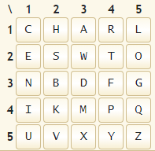

# Britisih Scientific

Author: Wozen
```
An old british scientific is trying to help you with this CTF, he only sent you one of his famous quotes. It seems that he has encripted a message, it could be the flag.

He always signs with his name and surname...
```

## Message.txt
```
Viewing the laws of the electric circuit from the point at which 
the labours of Ohm has placed us, there is scarcely any branch of 
experimental science in which so many and such various phenomena 
are expressed by formulae of such simplicity and generality...

QRRXDRPCKESRSNSWWY
```
Right, so the first part seems to be to find the author of this quote. Nothing easier than just googling the quote itself. And it turns out that `Charles Wheatstone` is the author. Now consider the following `He always signs with his name and surname...`</br>

## Ciphertext analysis

Since I know that Charles signs his name, I checked the lenghts of the two strings:
```
QRRXDRPCKESRSNSWWY
Charles Wheatstone
```
And it is the same! Now, we can begin analysing. We can safely rule out a rotation cipher (ROT), because for example `e` in Charles Wheatstone maps to `YSR`. Maybe it's a xor of their ascii values? But no, running a short xor script it returns nonsense.</br>
```
C 	->   Q
h 	->   R
a 	->   R
r 	->   X
l 	->   D
e 	->   R
s 	->   P
  	->   C
W 	->   K
h 	->   E
e 	->   S
a 	->   R
t 	->   S
s 	->   N
t 	->   S
o 	->   W
n 	->   W
e 	->   Y
``` 
Well, back to Google it is. Are there any more hints from Ser Charles Wheatstone? YES! He invented the [Playfair Cipher](https://en.wikipedia.org/wiki/Playfair_cipher)! This should have been obvious to me. Oh well. Also:
```
The Playfair is thus significantly harder to break since the frequency analysis....
```
There goes my idea.

## Playfair cipher

The thing we need to do is generate the table used for ecnryption. And we might be able to do this with his name. First we need to remove duplicates of letters:
```
Charles Wheatstone

CHARLES WTON
```
Time to try and map the grid on this online [decoder](https://www.dcode.fr/playfair-cipher).</br>
</br>
I omitted `J` for `I` as you usually exchange one of the two. And putting it against the ciphertext `QRRXDRPCKESRSNSWWY`:
```
PLAYFAIRISTHEBESTX
```
So the flag is:
```
NETON{PLAYFAIRISTHEBESTX}
```
Great! This was really fun. Really shows the importance of research before diving in head first.