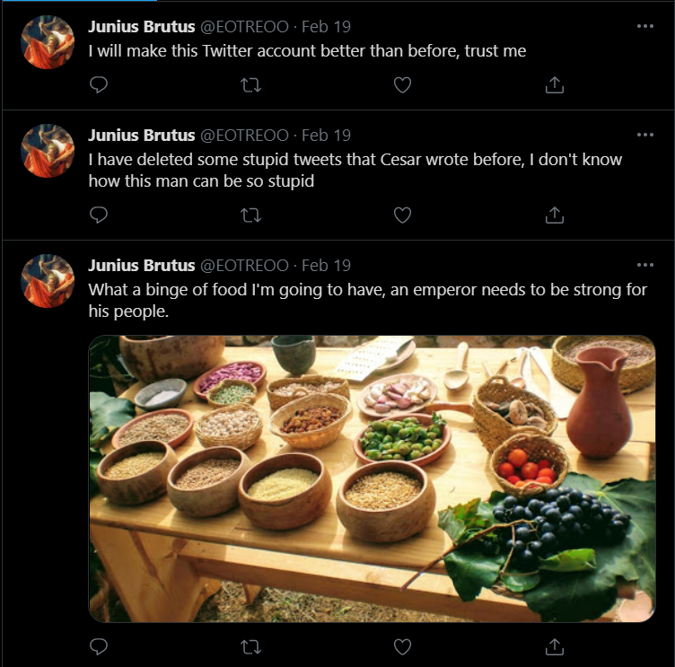
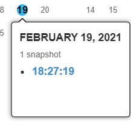
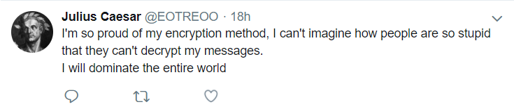

# Caesar's secret

This room is an OSINT room, we have to find a password to a .zip file. The only hint is this [link](https://twitter.com/EOTREOO).

## Twitter recon

Looks like someone took over the page:</br>
</br>
So this is not Caser's page anymore, interesting. Time to check out the tweets:</br>
</br>
Right! So Brutus did a brutal takeover and deleted a bunch of tweets. Maybe we can use the [wayback machine](https://archive.org/)

## Wayback

So when we open the wayback machine and enter the twitter profile link we see the following:</br>
</br>
So lets see if it fits our time frame:</br>
</br>
Proof of the crime, nice! But we can also see the time and date of this tweet. And it is after the wayback snapshot. So time to check it out.</br>
</br>
</br>
So nice! We have the original profile! And do we have there? Might one of the tweets give us a hint?</br>
</br>
Oh, the basis of cryptography classes. Who would have guessed it?

## Cipher

There are two things we can do, go to this [link](https://www.dcode.fr/caesar-cipher) and just decode, or write our own script with python for some practice!
```py
import string

def shift(ciphertext,push):
	plaintext = ''
	
	alphabet_uppercase = [ x for x in string.ascii_uppercase ]
	alphabet_lowercase = [ x for x in string.ascii_lowercase ]
	
	for c in ciphertext:
		if c.isupper():
			index = (alphabet_uppercase.index(c)+push)%26
			plaintext = plaintext+alphabet_uppercase[index]
		else:
			index = (alphabet_lowercase.index(c)+push)%26
			plaintext = plaintext+alphabet_lowercase[index]
	
	print(f'Plain = {plaintext} with +{push}')

ciphertext = 'HjqbxiPcndct'

for i in range(26):
	shift(ciphertext,i)
```
Since it is not the classic Caeser cipher, we have to test more than a 3 shift. Like this we bruteforce all options all the way back to itself.</br>
**Output:**</br>
```Java
Plain = IkrcyjQdoedu with +1
Plain = JlsdzkRepfev with +2
Plain = KmtealSfqgfw with +3
Plain = LnufbmTgrhgx with +4
Plain = MovgcnUhsihy with +5
Plain = NpwhdoVitjiz with +6
Plain = OqxiepWjukja with +7
Plain = PryjfqXkvlkb with +8
Plain = QszkgrYlwmlc with +9
Plain = RtalhsZmxnmd with +10
Plain = SubmitAnyone with +11 <-- And this is our answer! (Also colors!)
Plain = TvcnjuBozpof with +12
Plain = UwdokvCpaqpg with +13
Plain = VxeplwDqbrqh with +14
Plain = WyfqmxErcsri with +15
Plain = XzgrnyFsdtsj with +16
Plain = YahsozGteutk with +17
Plain = ZbitpaHufvul with +18
Plain = AcjuqbIvgwvm with +19
Plain = BdkvrcJwhxwn with +20
Plain = CelwsdKxiyxo with +21
Plain = DfmxteLyjzyp with +22
Plain = EgnyufMzkazq with +23
Plain = FhozvgNalbar with +24
Plain = GipawhObmcbs with +25
```
Then we use this to unzip the .zip file and we have a `secret.txt`:
```
The secret is that there are 10 types of people in the world, those who know binary and those who do not.


flag: 01001110 01000101 01010100 01001111 01001110 01111011 01001010 01110101 01101100 01101001 01110101 01110011 01000011 01100001 01100101 01110011 01100001 01110010 01111101
```
Beautiful, I don't feel like scripting this one, so I just used this [link](https://binarytotext.net/). And we have our flag: `NETON{JuliusCaesar}`
