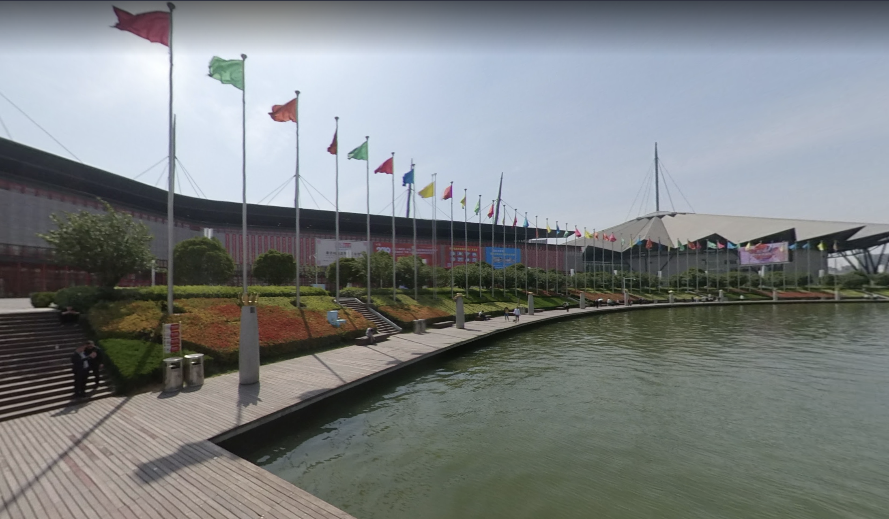
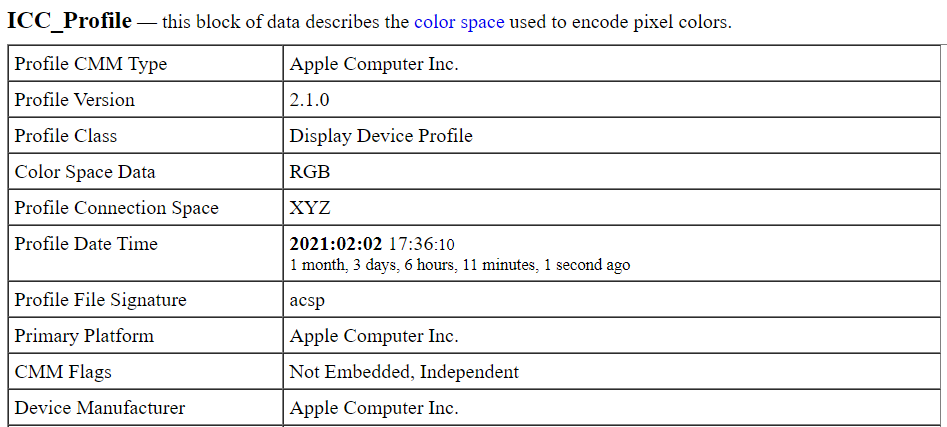
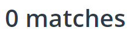
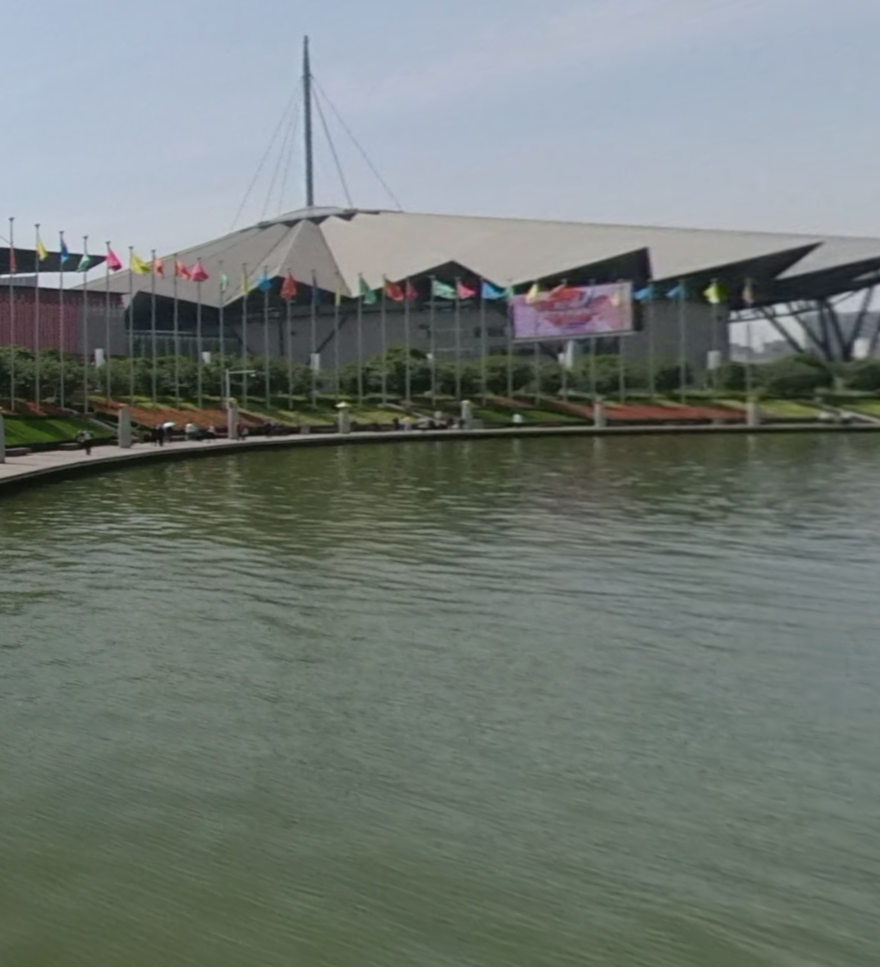
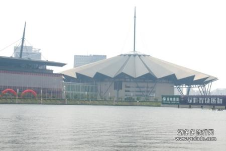
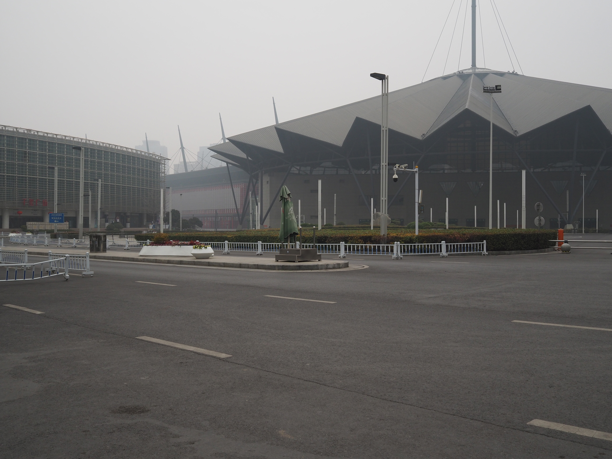
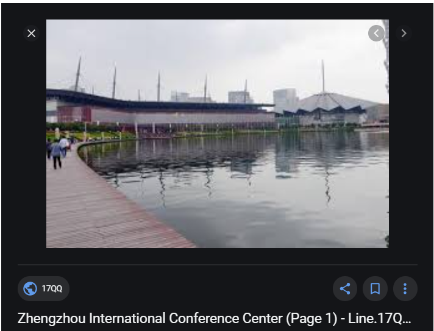

# Capture the Flag

Author: N0xi0us

```
A few years ago a cybersecurity competition took place near this site, could you find out which one ?
```

## The Image 
</br>
Some first thoughts:</br>
- Looking closer the flags are just colors, nothing specific<br>
- On one of the billboards I can make out `2019` </br>
- Next to water</br>
- The obvious: the roof!</br>

So what now. I went straight to reverse image [search](https://www.reverseimagesearch.com/) where I uploaded the image and set search on all sites. Maybe this is a sports venue, but the flags aren't country flags, that would show to me an international arena or conference hall.</br>
Now it was time to look at the image metadata [here](http://exif.regex.info/):</br>
</br>
Well it seeems that nothing of note, except for knowing that it was taken on an Apple device. Searching on [tineye](https://tineye.com/) resulted in:</br>
</br>
So I cropped the image down to the important bit:</br>
</br>
And searched again at `https://www.reverseimagesearch.com/`. This time `Baidu` had some results! A lot of images in fact. So I found out that the hall is in China (I suspected China,Vietnam or Thaiwan). Great! So I ran another reverse image search against this:</br>
</br>
Google and bing weren't any help, but `Yandex` was! I found the following twitter [post](https://twitter.com/meduza_en/status/1232370774360645633/photo/3)</br>
</br>
So I know it is in Zhengzhou. I altered the reverse image search on Google, I entered `Zhangzhou` and got the following:</br>
</br>
Now back to Google. So after Googling `Zhangzhou CTF` a video popped out!</br>
</br>
This [video](https://www.youtube.com/watch?v=2S_TXaGYD8E) was one of the first LO videos I watched, and I actually thought that the `cybersecurity competition` might have been this.

## The flag

`NETON{REAL_WORLD_CTF}`
