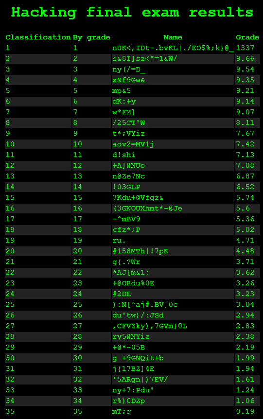
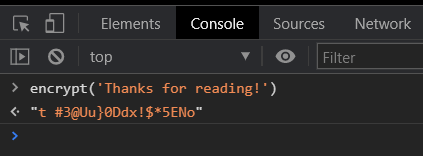
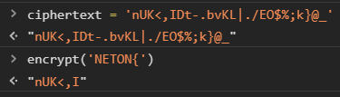

# Grades

Author: Raulet 
```
The end-of-course grades are already available on the UPV website, 
but apparently a hacker has managed to modify his own grade and randomize the others. 
He has also encrypted the names of all the students to make it more difficult to identify him, 
we need your skills to catch him.
```

## The site
The source of the website is fully available, so I downloaded it and here is what it looks like:
</br>

</br>
</br>
As promised, the entries are encrypted. We will have to decrypt it somehow, but how? 

## Decryption

The encryption function is fully available in the source:
```js
function encrypt(_0x40a681) {
    var _0x16b830 = 0x20, _0x561689 = 0x5e, _0x3db275 = 0x0, _0x38a41d = '';
    for (var _0x278871 = 0x0; _0x278871 < _0x40a681['length']; _0x278871++) {
        _0x38a41d = _0x38a41d + String['fromCharCode']((_0x40a681['charCodeAt'](_0x278871) + _0x3db275) % _0x561689 + _0x16b830), _0x3db275 = _0x3db275 + _0x40a681['charCodeAt'](_0x278871);
    }
    return _0x38a41d;
}
```
This looks disgusting, but do we even have to understand how the function works? This is not a crypto challenge, and here is why:
</br>

</br>
The function is available to us in the Dev Tools console! The flag is the first entry of the table, as its the only hardcoded encrypted entry. All the others are computed on load.
</br>

</br>
And is the proof of concept. `NETON{` encrypted with the function is equal to the first 6 letters of `ciphertext`. Now to just bruteforce the whole flag:
````javascript
var alphabet = "0123456789abcdefghijklmnopqrstuvwxyzABCDEFGHIJKLMNOPQRSTUVWXYZ!_{}";
var ciphertext = "nUK<,IDt-.bvKL|./EO$%;k}@_";
string = 'NETON{';

for(let i = 5; i < ciphertext.length; i++) {
    for(let j = 0; j < alphabet.length; j++) {
       var temp = encrypt(string+alphabet.charAt(j))
            if (temp === ciphertext.slice(0,i)) {
                string += alphabet.charAt(j);
            }
    }
}
````
The first loop iterates over the ciphertext and second over the alphabet, then I encrypt what we have confirmed to be part of the flag (in varibale string) and compare to a slice of the ciphertext. Pretty straight forward.
```
FLAG: NETON{Y0u_4r3_0n_th3_t0p!}
```