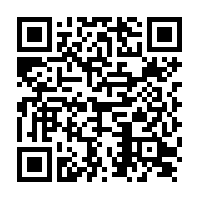

# Inception

Author: fire_dancer_shy
```
Try to get the flag :V
```

## First image

</br>
Which redirects to a url containing this(flagNetOn.txt):
```
PD94bWwgdmVyc2lvbj0iMS4wIiBlbmNvZGluZz0iVVRGLTgiPz4KPHN2ZyB2ZXJzaW9uPSIxLjEiIGJhc2VQcm9maWxlPSJ0aW55IiB4bWxucz0iaHR0cDovL3d3dy53My5vcmcvMjAwMC9zdmciIHdpZHRoPSIyMDAiIGhlaWdodD0iMjAwIj4KPHJlY3Qgc2hhcGUtcmVuZGVyaW5nPSJvcHRpbWl6ZVNwZWVkIiAgeD0iMCIgeT0iMCIgd2lkdGg9IjIwMCIgaGVpZ2h0PSIyMDAiIGZpbGw9IndoaXRlIiAvPgo8cmVjdCBzaGFwZS1yZW5kZXJpbmc9Im9wdGltaXplU3BlZWQiICB4PSIxMiIgeT0iMTIiIHdpZHRoPSI3IiBoZWlnaHQ9IjciIGZpbGw9ImJsYWNrIiAvPgo8cmVjdCB.........sYWNrIiAvPjwvc3ZnPg==
```
Yes, it is very long. A base64 encoded file. I decoded it at [base64decode.org](https://www.base64decode.org/). Which gave this(flag.svg):
```svg
<?xml version="1.0" encoding="UTF-8"?>
<svg version="1.1" baseProfile="tiny" xmlns="http://www.w3.org/2000/svg" width="200" height="200">
<rect shape-rendering="optimizeSpeed"  x="0" y="0" width="200" height="200" fill="white" />
<rect shape-rendering="optimizeSpeed"  x="12" y="12" width="7" height="7" fill="black" />
<rect shape-rendering="optimizeSpeed"  x="19" y="12" width="7" height="7" fill="black" />
<rect shape-rendering="optimizeSpeed"  x="26" y="12" width="7" height="7" fill="black" />
<rect shape-rendering="optimizeSpeed"  x="33" y="12" width="7" height="7" fill="black" />
<rect shape-rendering="optimizeSpeed"  x="40" y="12" width="7" height="7" fill="black" />
<rect shape-rendering="optimizeSpeed"  x="47" y="12" width="7" height="7" fill="black" />
<rect shape-rendering="optimizeSpeed"  x="54" y="12" width="7" height="7" fill="black" />
<rect shape-rendering="optimizeSpeed"  x="75" y="12" width="7" height="7" fill="black" />
<rect shape-rendering="optimizeSpeed"  x="110" y="12" width="7" height="7" fill="black" />
<rect shape-rendering="optimizeSpeed"  x="124" y="12" width="7" height="7" fill="black" />
<rect shape-rendering="optimizeSpeed"  x="138" y="12" width="7" height="7" fill="black" />
<rect shape-rendering="optimizeSpeed"  x="145" y="12" width="7" height="7" fill="black" />
<rect shape-rendering="optimizeSpeed"  x="152" y="12" width="7" height="7" fill="black" />
<rect shape-rendering="optimizeSpeed"  x="159" y="12" width="7" height="7" fill="black" />
....
....
....
<rect shape-rendering="optimizeSpeed"  x="110" y="180" width="7" height="7" fill="black" />
<rect shape-rendering="optimizeSpeed"  x="145" y="180" width="7" height="7" fill="black" />
<rect shape-rendering="optimizeSpeed"  x="173" y="180" width="7" height="7" fill="black" />
<rect shape-rendering="optimizeSpeed"  x="180" y="180" width="7" height="7" fill="black" /></svg>
```
Upon opening, its another qr code! And it gives us the flag: `NETON{ThatsRoughBuddy}`