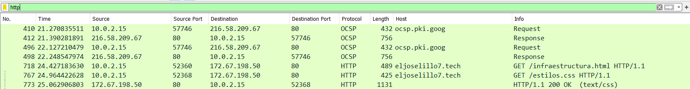
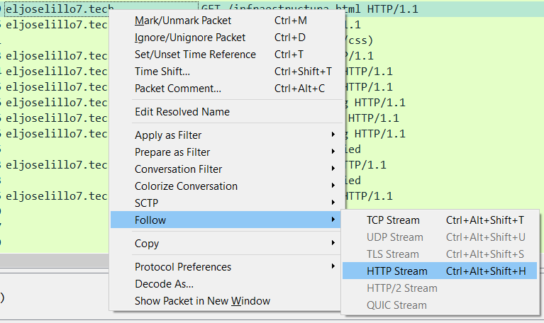
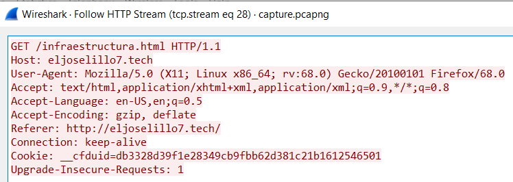
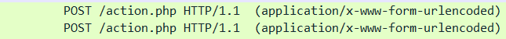

# Infiltration

Author: eljoselillo7 
```
Someone has hacked into our school! Try to find out what happened.
```

## Wireshark

There is a wireshark capture to analyze. Whenever I'm to do a forensic analysis on a network capture with Wireshark, I always start by looking at the `http` requests, and following `http streams`. </br>
</br>
So here is all the captured http traffic. Now I look for `http streams` to follow:</br> 
</br>
</br>
Kinda useless. Now I have a filter ready from one forensic workshop I attended `(http.request or tls.handshake.type == 1) and !(ssdp)`, which yields some nice and interesting results:</br>
</br>
This looks interesting! Time to follow it and look through the stream. First off, there are credentials presented:
```
email=potato%40ies.com&password=super_password
```
^ These creds were wrong, so I scrolled lower:
```
email=neton%40neton.neton&password=NetoNiaNo
```
And this was correct! With a corresponding response:
```html
<!DOCTYPE html>
<html lang="es">
    <head>
        <title>IES</title>
        <meta charset="utf-8">
        <link rel="stylesheet" href="https://cdn.jsdelivr.net/npm/bootstrap@4.5.3/dist/css/bootstrap.min.css" integrity="sha384-TX8t27EcRE3e/ihU7zmQxVncDAy5uIKz4rEkgIXeMed4M0jlfIDPvg6uqKI2xXr2" crossorigin="anonymous">
        <script src="https://code.jquery.com/jquery-3.5.1.slim.min.js" integrity="sha384-DfXdz2htPH0lsSSs5nCTpuj/zy4C+OGpamoFVy38MVBnE+IbbVYUew+OrCXaRkfj" crossorigin="anonymous"></script>
        <script src="https://cdn.jsdelivr.net/npm/popper.js@1.16.1/dist/umd/popper.min.js" integrity="sha384-9/reFTGAW83EW2RDu2S0VKaIzap3H66lZH81PoYlFhbGU+6BZp6G7niu735Sk7lN" crossorigin="anonymous"></script>
        <script src="https://cdn.jsdelivr.net/npm/bootstrap@4.5.3/dist/js/bootstrap.min.js" integrity="sha384-w1Q4orYjBQndcko6MimVbzY0tgp4pWB4lZ7lr30WKz0vr/aWKhXdBNmNb5D92v7s" crossorigin="anonymous"></script>
        <link rel="stylesheet" href="https://cdnjs.cloudflare.com/ajax/libs/font-awesome/4.7.0/css/font-awesome.min.css">
        <meta name="viewport" content="width=device-width, initial-scale=1">
    </head>
    <body class="bg-dark">
        <div class="container-fluid" style="height: 100vh;">
            <div class="row" style="padding-top: 20%;">
                <div class="col-12 text-center">
                    <h1 class="display-1 text-white">NETON{N1c3_4n4l1s1s!}</h1>
                </div>                                      ^ FLAG
            </div>
        </div>
    </body>
</html>
```
There it is! </br>
**FLAG:**`NETON{N1c3_4n4l1s1s!}`