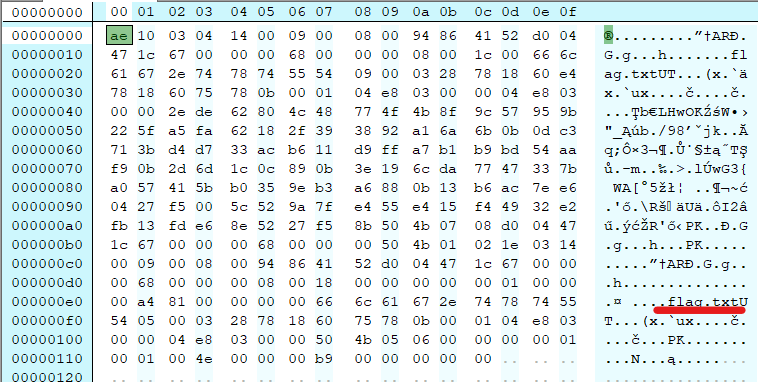
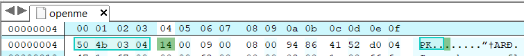
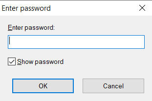
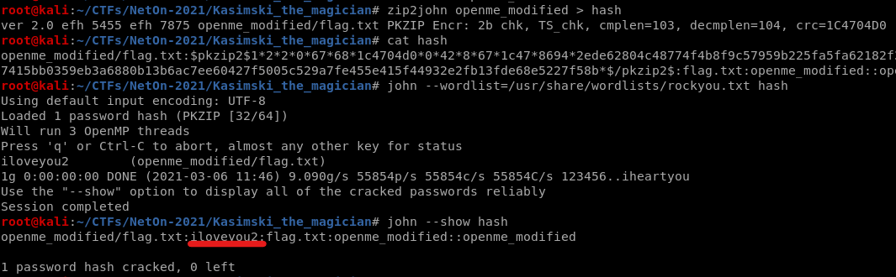
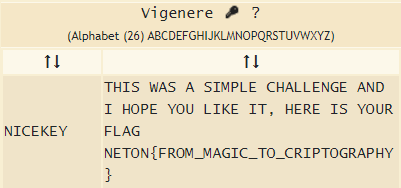

# Kasiski the Magician

Author: Marmeus
```
You must get the ciphered flag stored from this modified and protected file.
```

## File identification

Opening the file in a hexeditor:</br>
</br>
And it contains the flag.txt. It is some kind of zip file. But when trying to decompress it, an error is shown. There is a mistake in one of the offsets? Huh... so time to change the hex.

## Correcting the file

The correct zip signature is `50 4B 03 04` and that is not correct in our file. So I fixed it:</br>
</br>
Nice! Now I can extract it!</br>
</br>
Or not. Well, time to use `zip2john` and crack the password:</br>
</br>
Perfect! Password found. Now on to the `flag.txt` file:
```
GPKW GEQ N AKQZPC PPCPVILTM CRN M FBXG CYY JVSG MD, LCEM KW ISSE NNEQ RCGWP{JBSK_ZIIMM_XM_PZKTDSEEIRLI}
```
Ah, so not yet.

## Vigenere cipher

I identified this as a Vigenere cipher. It is definitely not a classic ROT because in `RCGWP` `R` and `P` are both `N` from `NETON{`. I used an online [tool](https://www.dcode.fr/vigenere-cipher) to find the key and solve the challenge!</br>
</br>
Flag found!
