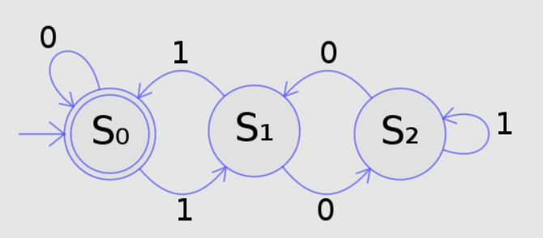
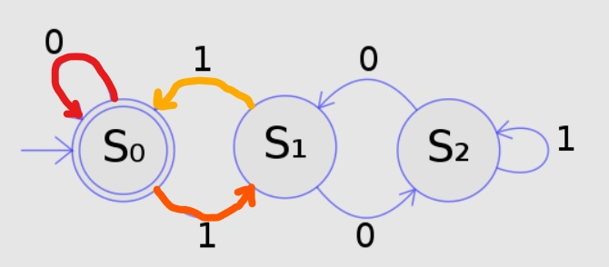
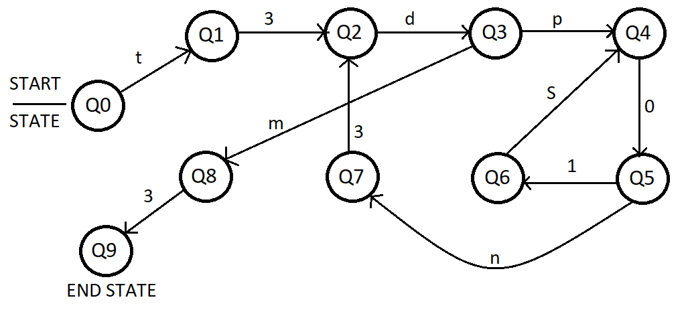
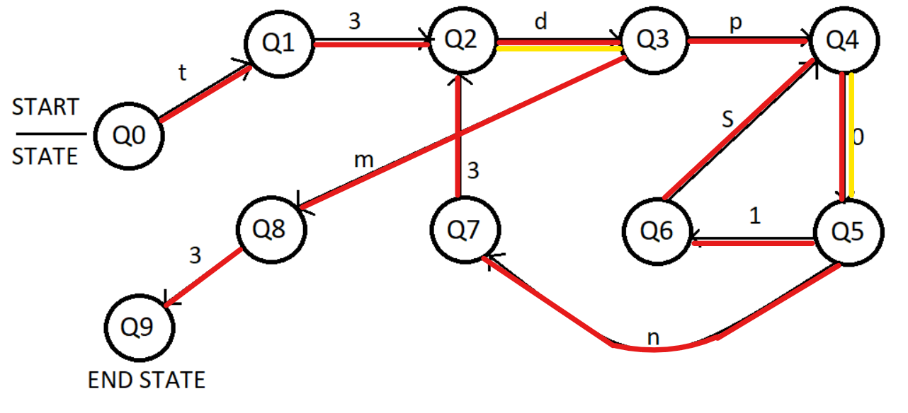

# MathTomata

Author: Nikeley
```
Ada was a spectacular mathematician, but she realized that her husband Ted was slowly killing her with poison
to preserve the latest patents she had created. Since she couldn’t leave the house, she decided to hide a 13-character
message that would be revealed once the ‘DFA’ was resolved. Can you find the message?

Q = {Q0,Q1,Q2,Q3,Q4,Q5,Q6,Q7,Q8,Q9}

Σ = {d,m,n,p,s,t,0,1,3}

q0 = Q0

F = Q9

δ = f

f(Q0,t)=Q1; f(Q1,3)=Q2; f(Q2,d)=Q3; f(Q3,p)=Q4; f(Q3,m)=Q8; f(Q4,0)=Q5; f(Q5,1)=Q6; f(Q5,n)=Q7; f(Q6,s)=Q4; f(Q7,3)=Q2; f(Q8,3)=Q9;
```

## What is DFA?

This is where good ol' Google comes in. I Googled (duckducked actually) `DFA wikipedia`, and yeah, wikipedia is not considered the best resource by everyone. But to me it's the first thing that springs to mind. SO [here](https://en.wikipedia.org/wiki/Deterministic_finite_automaton).</br>
</br>
Looking at the example notation, this challenge is obviously a `Deterministic Finite Automaton` for which the following is true:</br>
```
Q = {Q0,Q1,Q2,Q3,Q4,Q5,Q6,Q7,Q8,Q9}; Q is a finite set of states that the automaton has

Σ = {d,m,n,p,s,t,0,1,3}; Σ is the alphabet for our automaton 

δ = f; δ is the transition function 

q0 = Q0; q0 is the start state 

F = Q9; accept state

f(Q0,t)=Q1; f(Q1,3)=Q2; f(Q2,d)=Q3; f(Q3,p)=Q4; f(Q3,m)=Q8; f(Q4,0)=Q5; f(Q5,1)=Q6; f(Q5,n)=Q7; f(Q6,s)=Q4; f(Q7,3)=Q2; f(Q8,3)=Q9;

^ And this essentially a transition table, we know what a certain input to a given state will lead to.
```
Okay, this is all nice and dandy. But what are we supposed to do? Well consider the following example (taken from [wikipedia](https://upload.wikimedia.org/wikipedia/commons/thumb/9/94/DFA_example_multiplies_of_3.svg/537px-DFA_example_multiplies_of_3.svg.png)):</br>

</br>
This is a graphical representation of the following automaton:
```java
Q = {S0,S1,S2}

Σ = {0,1}

δ = f

q0 = S0

Transition table:
+---------------------------+
|f(S0,0) = S0 | f(S0,1) = S1|
|---------------------------|
|f(S1,0) = S1 | f(S1,1) = S0|
|---------------------------|
|f(S2,0) = S1 | f(S2,1) = S2|
+---------------------------+
```
The computer science students are probably vincing at my explanation right now, but here we go. The table above might seem confusing, given the chart from before you can clearly see how it goes. The numbers above the transition arrows mean the input to the preceding state. That is why an initial input of 0 leads to `S0`. Also, the input is interpreted as a sequence one by one. So if the input is `011` the transition will be:</br>
</br>
The first transition is in `red` where `S0` maps to itself thanks to the `0`. Then a `1` is sent, this maps from `S0` to `S1`, and finally a `1` is sent which maps `S1` to `S0` (yellow).</br>
</br>
The long winded explenation is over, on to the solution.

## Solution

So here is the (very poorly made) graphical representation of our DFA. 
</br>

</br>Just to refresh your memory, here is the formal representation:
```Java
Q = {Q0,Q1,Q2,Q3,Q4,Q5,Q6,Q7,Q8,Q9}

Σ = {d,m,n,p,s,t,0,1,3}

q0 = Q0

F = Q9

δ = f

f(Q0,t)=Q1; f(Q1,3)=Q2; f(Q2,d)=Q3; f(Q3,p)=Q4; f(Q3,m)=Q8; f(Q4,0)=Q5; f(Q5,1)=Q6; f(Q5,n)=Q7; f(Q6,s)=Q4; f(Q7,3)=Q2; f(Q8,3)=Q9;
```
The final state is `Q9` so we know we want to get to that.</br>
Trying to take a direct route straight to `Q9` gives us `t3dp0n3dm3`, but doesn't this seem incosistent with our hint at the start? Ada was `poisoned` and like this we left out `1s`! So here is the final transition:
</br>

</br>
Here red lines are the through transition on the line and yellow is a second transition. So what do we get now? `t3dp01s0n3dm3`.</br>
**FLAG:**`NETON{t3dp01s0n3dm3}`
