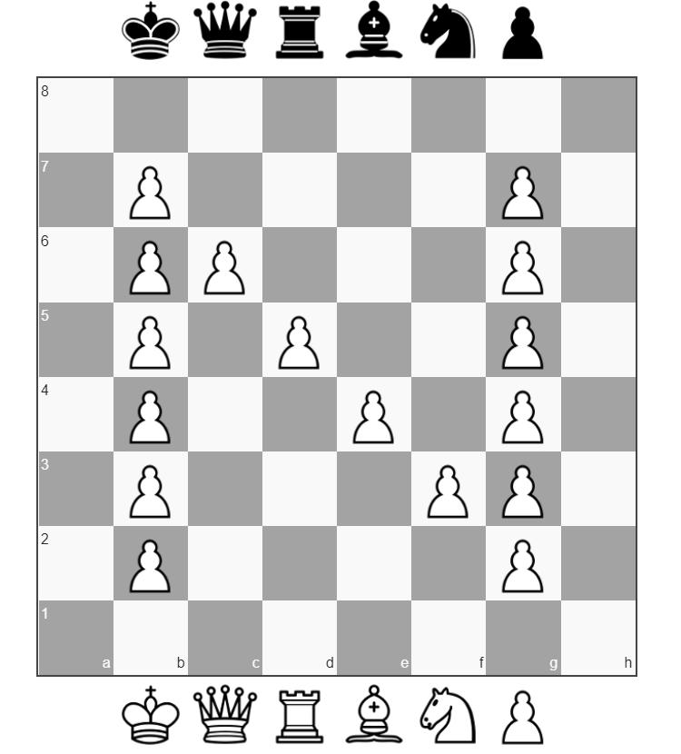

# Pawn Pawn

Author: eljoselillo7
```
A king found this files on his wife's usb drive. Can you help us discover the secret message?
```

## notes.wav

So we have to files, `notes.wav` and `secret.7z`. When trying to extract `secret.7z` it asks for a password. So time to play the `noets.wav` file. Which turns out to be Morse code!</br>
</br>
Now a lot of people might have just done it by hand, but I tried and had a lot of mistakes. Why not use the tools availabe? Like this [one](https://morsecode.world/international/decoder/audio-decoder-adaptive.html)! An online Morse audio decoder.
```
THE ZI P P AS S W O R D I S 7 575 7 5 75
```
Extracted to `secret/` was a file `pawned.txt`:
```
8/1P4P1/1PP3P1/1P1P2P1/1P2P1P1/1P3PP1/1P4P1/8 w - - 0 1
8/1PPPPP2/1P6/1P6/1PPPPP2/1P6/1PPPPP2/8 w - - 0 1
8/1PPPPPP1/1PPPPPP1/3PP3/3PP3/3PP3/3PP3/8 w - - 0 1
8/1PPPPPP1/1P4P1/1P4P1/1P4P1/1P4P1/1PPPPPP1/8 w - - 0 1
8/1P4P1/1PP3P1/1P1P2P1/1P2P1P1/1P3PP1/1P4P1/8 w - - 0 1
5P2/3PP3/3P4/3P4/2PP4/3P4/3PP3/5P2 w - - 0 1 {
8/1PPPPPP1/1P6/1P6/1P6/1P6/1PPPPPP1/8 w - - 0 1 C
8/1P4P1/1P4P1/1PPPPPP1/1P4P1/1P4P1/1P4P1/8 w - - 0 1 H
8/1PPPPPP1/1P6/1P6/1PPPPPP1/1P6/1PPPPPP1/8 w - - 0 1 E
8/1PPPPPP1/1P6/1P6/1P6/1P6/1PPPPPP1/8 w - - 0 1 C
8/1P2P3/1P1P4/1PP5/1P1P4/1P2P3/1P3P2/8 w - - 0 1 K
8/8/8/8/8/8/1PPPPPP1/8 w - - 0 1 _
8/1P4P1/1PP2PP1/1P1PP1P1/1P1PP1P1/1P4P1/1P4P1/8 w - - 0 1 M
8/3PP3/2P2P2/1P4P1/1PPPPPP1/1P4P1/1P4P1/8 w - - 0 1 A
8/1PPPPPP1/1PPPPPP1/3PP3/3PP3/3PP3/3PP3/8 w - - 0 1 T
8/1PPPPP2/1P6/1P6/1PPPPP2/1P6/1PPPPP2/8 w - - 0 1 E
3P4/4PP2/5P2/5P2/5PP1/5P2/4PP2/3P4 w - - 0 1 }
```
Now I play chess sometimes, but this meant nothing to me. Time to google around.</br>

## Chess!

So I ended up on [wikipedia](https://en.wikipedia.org/wiki/Forsyth%E2%80%93Edwards_Notation). I have seen the FEN notation on one of George Hotz's videos. So now to find an online interpreter for these. Like [this one](https://chesssuggest.com/):</br>
</br>
So I got this after entering the first FEN line. Now to just do this over the whole file.
```
NETON{CHECK_MATE}
```
And a flag! That was really creative!!
