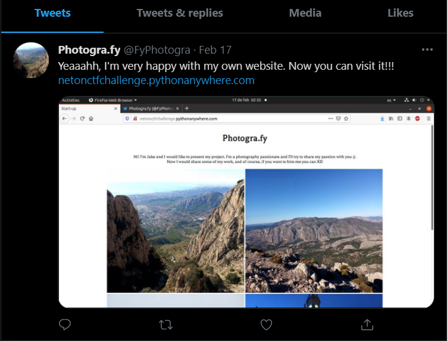
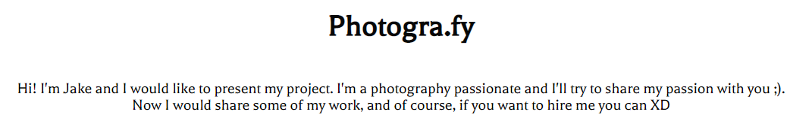
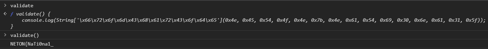
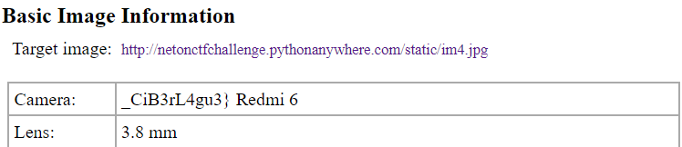

# Photogra.fy

Authors: Jordivaño & CarLos 
```
Hi, you had been selected for this job. Don't worry is pretty easy. We detected something strange with a new photographer whose name is Jack, and he creates a start-up called Photogra.fy. We found him on Twitter, and saw that he is making a web. But it's strange. I mean, do you think that a photographer can develop a web page well?

If you accept the job here is his Twitter account:

https://twitter.com/FyPhotogra

PD: If you don't, you are death :D

Signed:

FBI
```

## Twitter recon

Checking out the provided link I saw:</br>
</br>
So there is a link to his blog that we can check out!</br>
</br>
And below it are 4 photos. Mountain views and such. Source code check!
```html
<!DOCTYPE html>
<html lang="en">
<head>
	<meta charset="utf-8">
	<meta name="viewport" content="width=device-width, initial-sacale=1.0">
	<meta http-equiv="X-UA-Compatible" content="ie=edge">
    <link href='http://fonts.googleapis.com/css?family=Balthazar' rel='stylesheet' type='text/css'>
    <link rel="stylesheet" href="/static/style.css">
	<script type="text/javascript" src="/static/login.js"></script>
	<title>Start-up</title>
</head>
<body>
	<div class="content">
      <header>
          <div class="title1">
             <h1>Photogra.fy</h1>
          </div>
          <div class="introduction">
          	<p>Hi! I'm Jake and I would like to present my project. I'm a photography passionate and I'll try to share my passion with you ;).</br>Now I would share some of my work, and of course, if you want to hire me you can XD </p>
          </div>
          <div class="photos">
          	<image src="/static/im1.jpg" alt="acantilado" height="450px" width="500px"/>
          	<image src="/static/im2.jpg" alt="Top of the mountain" height="450" width="500"/>
          	<image src="/static/im3.jpg" alt="Snow" height="450px" width="500"/>
          	<image src="/static/im4.jpg" alt="Town hall (Valencia)" height="450px" width="500"/>
          </div>
          <div class="contact">
          	<a href="https://twitter.com/FyPhotogra?ref_src=twsrc%5Etfw" class="twitter-follow-button" data-show-count="false">Follow @FyPhotogra</a><script async src="https://platform.twitter.com/widgets.js" charset="utf-8"></script>
          </div>
      </header>

</body>
</html>

</html>
```
And I see custom javascript (that was on twitter as well) `<script type="text/javascript" src="/static/login.js"></script>` as well as custom css `<link rel="stylesheet" href="/static/style.css">`.

## Checking out the files

Javascript first!
```js
function validate() {
    console.log(String['\x66\x72\x6f\x6d\x43\x68\x61\x72\x43\x6f\x64\x65'](0x4e, 0x45, 0x54, 0x4f, 0x4e, 0x7b, 0x4e, 0x61, 0x54, 0x69, 0x30, 0x6e, 0x61, 0x31, 0x5f));
}
```
I copy pasted it into the chrome console and ran the function:</br>
</br>
Part of the flag. TIme to check out css now!
```css
html {
	margin: 0;
	padding: o;
}
body {
	font-family: 'Balthazar';
	font-size: 13pt;
	background-color:  # #ffffff ;
	padding: 10px;
	margin: 0;
}
header .title1 {
	text-align: center;
	margin-bottom: 40px;
	color:  #080808;

}
header .introduction {
 	text-align: center;
 	/*Maybe some picture has something interesting...*/

}
header .photos {
 	text-align: center;
}
header .contact {
 	text-align: right;
}
```
A nice hint. Time to use the trusty site [exif.regex.info](http://exif.regex.info/exif.cgi) for all the images! 

## Putting the flag together

After trying the first 3 photos I was just hoping it wouldn't be anything worse than this exif checking, and it wasn't:</br>
</br>
Second part! Great! Now together:</br>
**FLAG:**`NETON{NaTi0na1__CiB3rL4gu3}`