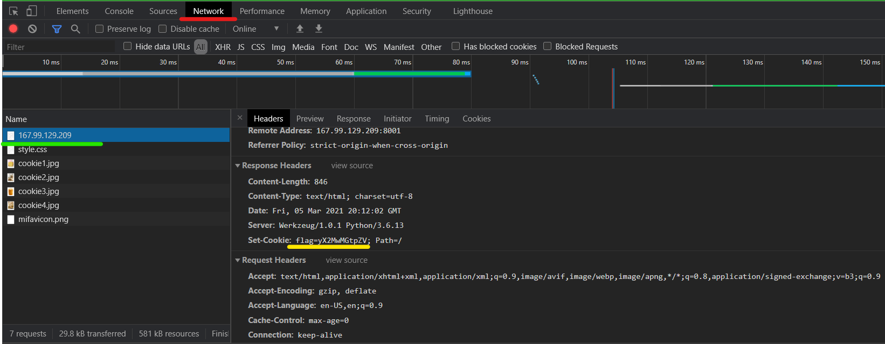

# Picnicnic

Author: eljoselillo7

## Web

Again, before opening I ran [webctf](https://github.com/xnomas/web-ctf-help):
```bash
webctf http://167.99.129.209:8001/

=============
COMMENTS
=============

[+] 1 :   Uuuuummmmmmmmmmmmmmmmm :^)

=============
SCRIPTS
=============


=============
IMAGES
=============

sources:
--------
[+] 1 : static/cookie1.jpg
[+] 2 : static/cookie2.jpg
[+] 3 : static/cookie3.jpg
[+] 4 : static/cookie4.jpg

alts:
-----
[+] 1 : No alt
[+] 2 : No alt
[+] 3 : No alt
[+] 4 : No alt

===================
INTERESTING HEADERS
===================

Set-Cookie : flag=TkVUT057MHV; Path=/
Server : Werkzeug/1.0.1 Python/3.6.13
```
And I saw a cookie, feels like base64 to me. So going to [this site](https://www.base64decode.org/) and entering the cookie resulted in this:
```
NETON{0u
```
Part of the flag. Interesting! Probably BurpSuite time again! Or is it even needed? Let me show you another leet (1337) tool! `Ctrl+Shift+I`.

## Inspecting headers

</br>
So, hit `Ctrl+Shift+I` and navigate to the `Network` tab (red). Then pres `Ctrl+R` to refresh the page and receive all request and response headers again (this includes cookies). Click on the first item you seee, in my case the IP of the webserver (green). On the right you should see a `headers` tab open and as you can see, there is another part of the flag (yellow).
```
NETON{0ur_c00kie
```
Oh yes, c00kies indeed. Now we can repeat the same steps for each item and keep checking headers.</br>
I read through the whole items list and saw no more, so I tried refreshing the page, and sure enough a different response from the server again! 
```
NETON{0ur_c00kieS_4re_4w
```
So lets go on:
```
NETON{0ur_c00kieS_4re_4wes0me!}
```
Yes they are! Cookies with flags! (health hazard?)
</br>Here is the base64 `TkVUT057MHVyX2MwMGtpZVNfNHJlXzR3ZXMwbWUhfQ==`
