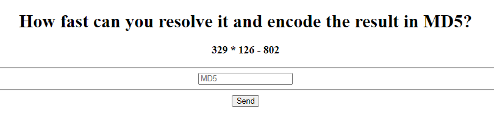

# RUN RUN RUN

Author: X4v1l0k</br>
```
How fast can you resolve it and encode the result in MD5?
```

## The challenge:

I opened up the website:</br>
</br>
And the number to compute changes with each request. So how can we automate this to be fast enough? Well first view the source:
```html
<!DOCTYPE html>
<html>
	<head>
	</head>
	<body>
				<form action="/index.php" method="post">
			<div align='center'>
				<h1>How fast can you resolve it and encode the result in MD5?</h1>
				<h3>790 * 556 - 927</h3>
				<hr>
				<input type="text" placeholder="MD5" name="md5" required>
				<hr>
				<button type="submit" name="send" class="boton">Send</button>
			</div>
		</form>
	</body>
</html>
```
We need this to know what to scrape for. So `<h3></h3>` will contain the number to hash, input `md5` will be where to enter the hash and then submit with the button `send`. So the libraries to use are requests and BeautifulSoup.

## Solving

Requests sends a request. Shocking, I know! BeautifulSoup is used for html scraping, so we can search for the `<h3>` tags and then post the data to `/index.php`. 
```python
import requests
import hashlib

from bs4 import BeautifulSoup

url = 'http://167.99.129.209:7777/'
post_url = url + '/index.php' 

s = requests.Session()
r = s.get(url).text 
soup = BeautifulSoup(r,'html.parser')

to_hash = soup.find_all('h3')[0]
to_hash = str(to_hash)[4:-5] # slice of the <h3> tags
to_hash = eval(to_hash)

to_hash = str(to_hash).encode('ascii')
hashed = hashlib.md5(to_hash).hexdigest()

data = { 'md5' : str(hashed) }

post = s.post(post_url, data=data)

print(post.text)
```
I used a session so that the server recognises its still the same session. I wanted to be sure not to have a problem with the server generating a new number on the post. Otherwise the script is pretty simple.
```html
<!DOCTYPE html>
<html>
	<head>
	</head>
	<body>
		<h1 align='center' style='color: green;'>Nice script! Take your flag: NETON{ScR1pT1ng_5a9522b8a3a9d3e2a3bf373803fa8e6c}</h1>		<form action="/index.php" method="post">
			<div align='center'>
				<h1>How fast can you resolve it and encode the result in MD5?</h1>
				<h3>532 * 154 - 330</h3>
				<hr>
				<input type="text" placeholder="MD5" name="md5" required>
				<hr>
				<button type="submit" name="send" class="boton">Send</button>
			</div>
		</form>
	</body>
</html>
```
And there is the flag. Very nice!
