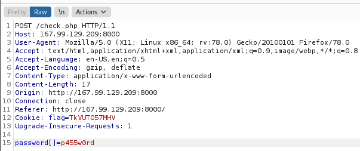
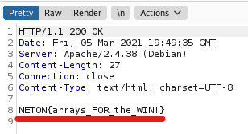

# Welcome to Filterland

Author: eljoselillo7

## Web enumeration

Before opening the site, I usually use my [tool](https://github.com/xnomas/web-ctf-help) to scrape for comments and other stuff:
```
webctf http://167.99.129.209:8000/

=============
COMMENTS
=============

[+] 1 :   I have made the file check.php.bak available to you. Please, send me an email if you find something wrong

=============
SCRIPTS
=============


=============
IMAGES
=============

sources:
--------

alts:
-----

===================
INTERESTING HEADERS
===================

Server : Apache/2.4.38 (Debian)
```
Cool! That's a really good one for us. Time to try and download `check.php.bak` by visiting `http://167.99.129.209:8000/check.php.bak` and it downloads, very nice!</br>
Here is the website:</br>
</br>
I obviously don't know the password, so time to look at the source code.

## check.php
```php
<?php
	$FLAG =  (file_get_contents("/flag.txt")); //SECRET
	$PASSWORD = $_POST['password']; //User password

	if(isset($PASSWORD)){
	
	$PASSWORD = str_replace("s4cuRe_p4sW0rD","Nice_try!",$PASSWORD); //Replace

	if(strcmp('s4cuRe_p4sW0rD', $PASSWORD) == 0){ //Check
			
			echo $FLAG;
		
		}
		else{
			header("Location: /fail.html");
			die();
		}

	}
	else {
		echo "Give me what I'm looking for ):";
	}

?>
```
So the `$PASSWORD` variable is set by us on the button press through a POST request. Then it checks if we didn't send an empty variable, if we sent something it replaces the password `s4cuRe_p4sW0rD` with `Nice_try!`. This happens no matter what, I tried adding different letters etc. Then it uses `strcmp` to check if we sent the correct password.</br>
What? After substitution it checks our password? That's right! That is the filter. So how can we do this? Well... Google! 

## Research

I searched for two things:</br>
`str_replace exploits`</br> 
`strcmp exploits`</br>
The former returned nada, but strcmp returned an interesting [read](https://danuxx.blogspot.com/2013/03/unauthorized-access-bypassing-php-strcmp.html). The important takeway is, that since `strcmp` has only three final states (return 0,return >0,return <0) if it fails it returns 0! Thus sending our variable as an array instead of a string errors out and evaluates to True! But how can we do this if our input is in a POST? BurpSuite

## Burpsuite

So here it is:</br>
</br>
There at the bottom is the change from a String to an Array with the simple use of `[]`. Then I forwarded that, and the flag is mine:</br>
</br>
This was fun, I love web challenges!
